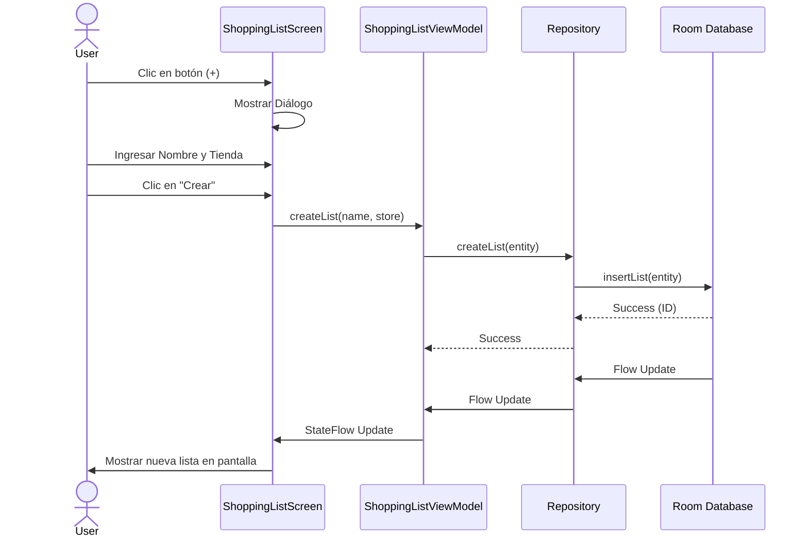
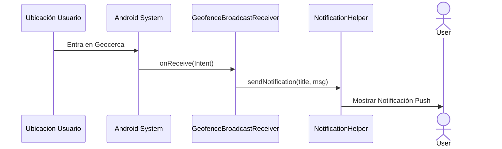

# Arquitectura del Sistema - Compritas

Este documento visualiza la estructura y el flujo de la aplicación mediante diagramas.

## 1. Arquitectura General (MVVM + Clean)

El siguiente diagrama muestra cómo interactúan las capas de la aplicación.

```mermaid
graph TD
    subgraph UI Layer
        Activity[MainActivity] --> Screen[ShoppingListScreen]
        Screen --> VM[ShoppingListViewModel]
    end

    subgraph Data Layer
        VM --> Repo[ShoppingListRepository]
        Repo --> Local[Room Database]
        Repo --> Remote[Firebase (Future)]
    end

    subgraph Utils
        Geofence[GeofenceManager]
        Notif[NotificationHelper]
    end

    Local --> DAO[ShoppingListDao]
    DAO --> Entity[ShoppingListEntity]
```

## 2. Flujo de Usuario: Crear Lista

Pasos que sigue el usuario para crear una nueva lista de compras.



## 3. Flujo de Notificación (Geofencing)

Cómo funciona el sistema de alertas por ubicación.


